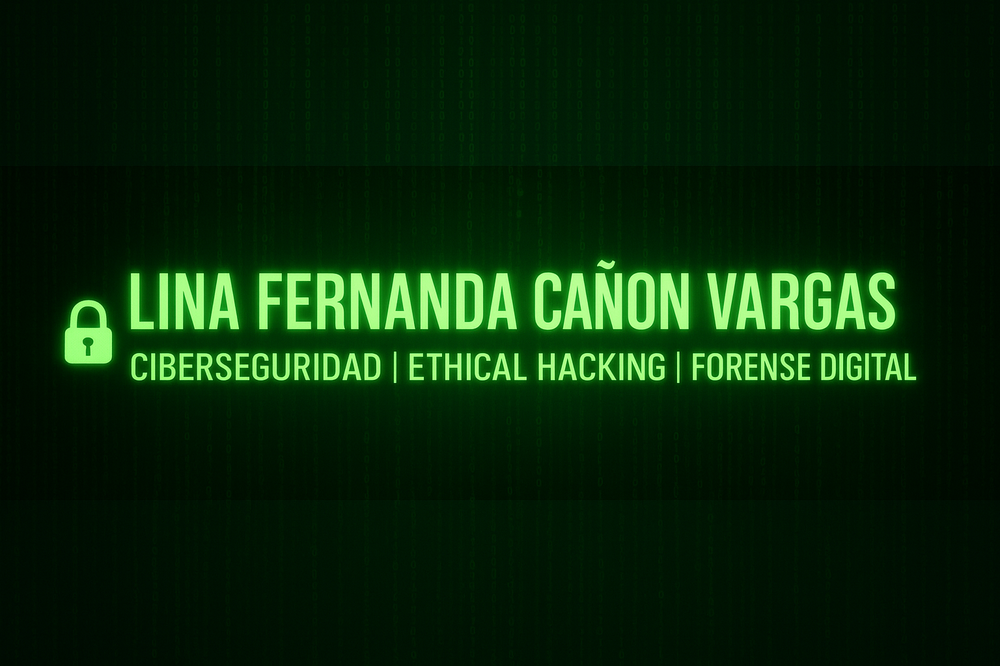

# 👋 ¡Hola, soy Lina Fernanda!

🔐 **Ingeniera de Sistemas** | Gestora de Cambios | Apasionada por la Ciberseguridad

Bienvenid@ a mi perfil de GitHub. Estoy en proceso de formación como Especialista en **Seguridad Informática** y aquí comparto mi ruta de aprendizaje, proyectos destacados y recursos sobre redes, pentesting y análisis forense.

## 🚀 Sobre mí
- Especialización en **Seguridad Informática**
- Experiencia en Soporte TI, Gestión de Cambios y Ciberseguridad
- Experiencia en proyectos prácticos y documentados
- Interés por soluciones innovadoras en seguridad informática
- Habilidades en Python, Linux, Windows Server, Nmap, Wireshark entre otros

## 🎸 Intereses personales
- Me encanta la música
- Amo la guitarra
- Trompetista en formación

## 📘 Portafolio y Proyectos
Explora mi [Portafolio en Ciberseguridad](/README.md) con proyectos organizados por niveles:
- Escaneo de redes y análisis de tráfico
- Fortalecimiento y configuración segura de sistemas
- Pentesting en laboratorios (DVWA, Metasploitable)
- Análisis forense digital

## 🛠️ Tecnologías y Herramientas
Linux | Windows Server | TCP/IP | Firewalls | IDS/IPS | Nmap | Wireshark | Nessus | Metasploit | Autopsy | Volatility | TryHackMe | HackTheBox

## 📫 Contacto
- **LinkedIn:** [***]
- **Correo:** [***]
- **GitHub:** [Lina-Fernanda]

---

✨ *Comprometida con el aprendizaje constante, el crecimiento profesional en ciberseguridad y la pasión por la música.*
